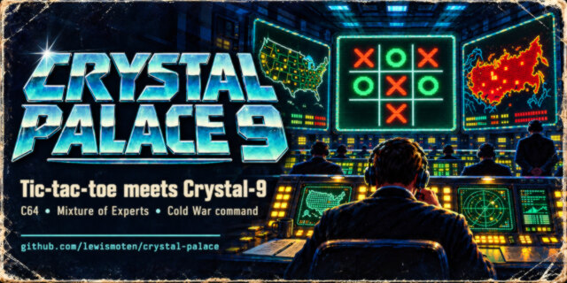

# Crystal Palace 64 (CP64)



Crystal Palace 64 is a Commodore 64 feasibility project for running **the original Crystal-9 packed INT4 neural-network weights** from a 1541 disk. It does not substitute a move table, hand-authored tic-tac-toe policy, distilled model, or requantized weights.

The project currently provides source-exact Crystal Palace presentation assets, a disk-backed INFO archive, a playable human board, and bounded original-weight engineering gates. It is not yet a claim of full player-vs-AI model gameplay.

## Quick start

From the repository root, on macOS or Debian/Ubuntu Linux:

```sh
scripts/bootstrap.sh
```

That one command creates `.venv`, installs Python dependencies (including
PyTorch), installs the repository-local assembler, downloads the verified
[original Crystal-9 FP16-scale INT4 artifact](https://huggingface.co/lewismoten/crystal-9/resolve/main/artifacts/crystal-9-int4-group2-packed-fp16-scales-v1.pt), verifies it, and creates the 48 pageable model packets.

Build the D64:

```sh
.venv/bin/python scripts/build_disk.py
```

Run the regression suite when changing source or assets:

```sh
.venv/bin/python -m pytest -q
```

The ready-to-load disk image is written to:

```text
release/crystal-palace-9.d64
```

For a presentation-only preview without model packets, skip `bootstrap.sh` and
run `scripts/bootstrap_64tass.sh` instead. The preview does not claim AI moves.

See [Building CP64](docs/BUILDING.md) for Linux/macOS setup, assembler details, model-packet requirements, and the complete verification sequence.

## Documentation

- [Build and environment setup](docs/BUILDING.md)
- [Runtime memory and disk-paging architecture](docs/RUNTIME_MEMORY_ARCHITECTURE.md)
- [D64 layout and original packet map](docs/D64_MANIFEST.md)
- [Stage history and proof boundaries](docs/STAGE_HISTORY.md)
- [Native screen-state assets, previews, palette, and VIC-II layout](assets/crystal-palace-screen-states/README.md)
- [C64 Online acceptance target](https://c64online.com/c64-online-emulator/)

## Repository layout

- `src/` — 6502 assembly, including the isolated original-token materialization module.
- `scripts/` — build, packet export, asset derivation, and D64 packaging tools.
- `assets/crystal-palace-screen-states/` — authoritative title, INFO, game, charset, and patch assets.
- `docs/` — build instructions, memory/paging design, manifest, and stage/proof documentation.
- `tests/` — 6502, disk, packet, asset, and build regressions.
- `release/` — generated local D64 output; ignored by Git.
