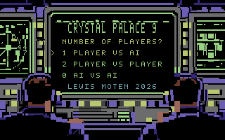
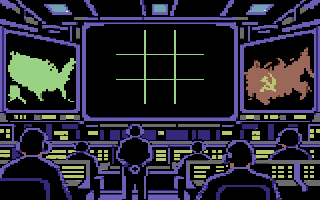

# Crystal Palace 64 (CP64)

A Commodore 64 feasibility project for running **the original Crystal-9 packed INT4 neural-network weights** from disk. CP64 does not replace the network with a move table, hand-authored tic-tac-toe policy, distilled model, or requantized weights.

The present executable is an engineering preview, not a claim of finished playable model parity. It combines source-exact Crystal Palace screen art with bounded, source-byte-backed Crystal-9 proof gates.

## Current milestone — Stage 079

`cs64-079-archive-ram-banking-fix.d64` is the current disk image produced locally by the build. It reads compiled INFO archive rows from RAM beneath BASIC ROM on a real C64, uses the supplied charset's blank/letter slots, handles archive Cursor Down before the ambiguous screen-code Q, and validates disk directory/file chains and BAM allocation before publishing.

There is no progress meter on a human mark. Rendering a supplied X/O patch is immediate, and showing a completed brown/orange/red/yellow line without an actual computer inference was misleading. A future meter may appear only across real original-weight disk/compute boundaries and will finish yellow from left to right.

The interactive browser path no longer calls KERNAL disk loads after each A–I key: that unconfirmed path is retained as an independently tested original-data bridge, not allowed to crash the board. Full legal-history model gameplay remains unestablished. See [`docs/D64_MANIFEST.md`](docs/D64_MANIFEST.md) for the exact 49-file disk layout and allocation rules.

## Screen-state source art

The raw VIC-II planes and matching C64-indexed PNG review images live in [`assets/crystal-palace-screen-states/`](assets/crystal-palace-screen-states/README.md). The binary planes are authoritative; PNGs are reproducible 320×200 indexed-palette renders for Git review and documentation.

| Preview | State |
| --- | --- |
|  | One-player title selection |
|  | Native blank multicolour playfield |

## Model provenance

- Original source: `~/crystal-9/releases/huggingface-int4-v1/artifacts/crystal-9-int4-group2-packed-fp16-scales-v1.pt`
- Source SHA-256: `63eee663a143ee478308144da406873c72c05b6d5226dbb2f5e329dacb1392eb`
- Source format: `crystal-9-packed-int4-fp16-scales-v1`
- Disk transport: 48 `C9Wxx.PRG` packets. Each packet is loaded at `$c000` and contains the original FP16 scale bytes and packed INT4 payload unchanged after a small `C9W1` transport header.

A KERNAL disk load overwrites that fixed `$c000` window, so CP64 pages one original tensor at a time rather than claiming full-model RAM residency.

## Build and verify

```sh
cd ~/cp64
scripts/bootstrap_64tass.sh
~/crystal-9/.venv/bin/python scripts/export_c64_layers.py --output build/layers
python3 scripts/render_screen_states.py --check
python3 scripts/build_disk.py
PYTHONPATH=/tmp/cp64-py65 python3 -m pytest -q
```

Generated `.d64` disk images are intentionally ignored by Git.

## Documentation

- [Stage history and proof boundaries](docs/STAGE_HISTORY.md)
- [Crystal Palace screen-state files, previews, palette, and VIC-II layout](assets/crystal-palace-screen-states/README.md)
- [Browser acceptance target: C64 Online Emulator](https://c64online.com/c64-online-emulator/)

## Repository layout

- `src/` — 6502 assembly: original-weight proof runtime and embedded-art browser preview.
- `scripts/build_disk.py` — assembler/D64 packaging entry point.
- `scripts/render_screen_states.py` — dependency-free, reproducible indexed PNG renderer.
- `assets/crystal-palace-screen-states/` — source-exact native art planes, board metadata, generated review previews.
- `tests/` — packet, disk, assembly, VIC-layout, and renderer regressions.
