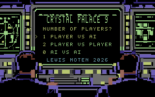
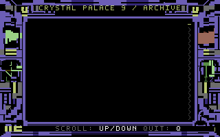
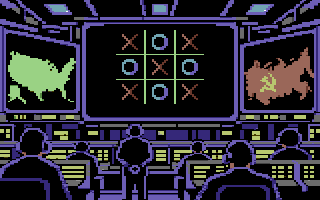
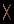

# Assets

`assets/` is the editable visual source for Crystal Palace 9. Every PNG is an
8-bit indexed image using the native 16-color Pepto C64 palette. Generated
C64 planes are ignored under `build/assets/`; the compiler checks their sizes
and SHA-256 values against `manifest.json`.

```sh
python3 scripts/compile_c64_assets.py
python3 scripts/render_screen_states.py --check
.venv/bin/python scripts/build_disk.py
```

## Title and INFO screens

`title/image.png` and `info/image.png` are the authoritative 320×200 character
screen images. Each 8×8 cell must be black plus at most one foreground C64
color. The compiler deduplicates the monochrome cell masks across the shared
`palace` character-screen group and emits these build artifacts:

- `build/assets/charset.bin` — the derived 256-slot custom charset;
- `build/assets/title/screen-*.bin` and `build/assets/title/color-*.bin` —
  derived title states; and
- `build/assets/info/screen.bin` and `build/assets/info/color.bin` — derived
  INFO entry state.

The source tree intentionally does **not** contain an editable atlas, glyph
map, or color-map PNG. `charset/id-order.json` is a small stable C64-ID
compatibility contract, not visual source art: it keeps existing runtime and
Markdown character codes stable while the atlas is derived from images.
`review/glyph-atlas.png`, `title/glyphs-*.png`,
`title/colors-*.png`, `info/glyphs.png`, and `info/colors.png` are generated
review images. They are useful inspections, not sources of truth.

The title uses one source image plus `title/selection.json` metadata. That
metadata moves the selector and changes selection highlight colors to derive
the Auto, One Player, and Two Player review/runtime states without keeping
three nearly identical source images.

A shared group is limited to **256 unique glyphs**. The compiler stops with a
clear diagnostic if the title/INFO image group exceeds that capacity: reduce
unique 8×8 masks or split screens that do not need the same charset into a
separate group.

The INFO image directly includes the entry footer `SCROLL: UP/DOWN  QUIT: Q`,
the full right-side scrollbar, and its initial highlighted marker. Generated
planes and review images therefore agree with the runtime entry state.

| Title screen | INFO screen after entry |
| --- | --- |
|  |  |

## Game board and marks

`game/board/` contains the fixed blank-board source planes:

- `bitmap-selectors.png` — 2-bit multicolor bitmap selectors.
- `screen-hi.png` and `screen-lo.png` — the two screen-memory color nibbles.
- `color-lo.png` — the Color RAM nibble.
- `preview.png` — the final 320×200 VIC-II rendering.

| Fixed board | Mark review |
| --- | --- |
|  |  |

`game/marks/x.png` and `game/marks/o.png` are the only editable mark sources.
They are **14×24 logical multicolor pixels**. VIC-II expands each logical pixel
to two horizontal physical pixels, so the marks display at 28×24 on the C64.
They use the shared black background plus two mark colors while preserving the
grid's local color slot.

| Editable X source | Editable O source |
| --- | --- |
|  |  |

The compiler stamps these two images into the named A–I rectangles from
`game/board/layout.json`, then derives ignored bitmap, screen, Color RAM, and
per-cell runtime patch planes. A separate all-X or all-O editable source image
is not needed.

## Other sources

- `archive/archive.md` — readable source text packaged as `ARCHIVE.MD`.
- `game/board/layout.json` — game-cell placement geometry.
- `manifest.json` — generated-plane size and digest contract.

## PNG requirements

PNGs must use color type 3 (indexed), 8-bit depth, no interlacing, and the
exact 16-entry Pepto C64 palette. Palette index values are VIC-II color IDs.
The normal game review is 320×200 physical pixels, representing a 160×200
multicolor logical-pixel grid.
