# Crystal Palace screen states

This directory contains the source-exact VIC-II planes used by CP64, plus reproducible indexed PNG review images. **The `.bin` planes are authoritative.** PNGs are documentation transports; the C64 program never loads them.

## Charset — raw `crystal-palace-charset.bin`

The custom charset is exactly 2,048 bytes: 256 glyphs × 8 bytes. The atlas below is a **16×16 cell**, black-and-white rendering of the raw glyph bits. A charset has no independent colour plane; title and INFO colour comes from their separate 1,000-byte colour-RAM planes.

| Raw 16×16 character atlas |
| --- |
| 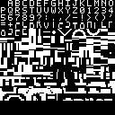 |

## Title states — screen plane, colour plane, combined VIC-II result

Each title is standard character mode: the `.screen.bin` chooses custom glyphs, and the `.color.bin` supplies one foreground colour nibble per 8×8 cell. The monochrome screen-plane image makes the raw glyph composition inspectable; the colour-plane image shows only the 40×25 colour cells; the combined image is the actual character-mode result.

The raw one-player screen plane has a black header band immediately above `CRYSTAL PALACE 9`; it contains no hill-like pixels. Any clipping seen there is runtime display residue, not source-art content, and must be corrected by title-state restoration rather than by changing these immutable source planes.

### One-player title

| `screen.bin` glyphs only | `color.bin` cells only | Combined title |
| --- | --- | --- |
|  | 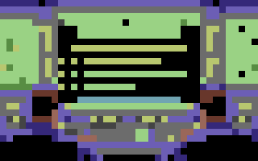 |  |

### Two-player title

| `screen.bin` glyphs only | `color.bin` cells only | Combined title |
| --- | --- | --- |
|  | 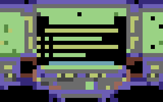 | 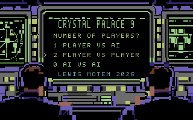 |

### AI-vs-AI title

| `screen.bin` glyphs only | `color.bin` cells only | Combined title |
| --- | --- | --- |
| 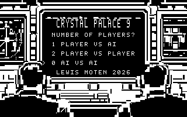 |  | 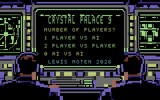 |

## Archive / INFO state — screen plane, colour plane, combined result

The INFO state is also standard character mode and uses the same custom charset. Its raw planes are intentionally shown separately so a review can distinguish glyph data from colour-RAM data.

| `crystal-palace-info.screen.bin` glyphs only | `crystal-palace-info.color.bin` cells only | Combined INFO state |
| --- | --- | --- |
| 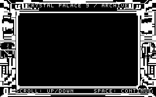 | 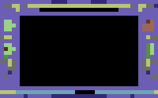 | 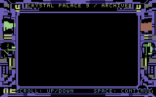 |

## Playfield states — VIC-II multicolour bitmap mode

The playfield is **multicolour bitmap mode**, not two-colour normal-resolution bitmap mode:

- Each bitmap byte contains four 2-bit logical pixels.
- Each logical pixel is **two physical pixels wide**, yielding a 160×200 logical grid rendered as a 320×200 physical image.
- Each 8×8 character cell has **three local colours plus one shared background**:
  - `00` → global background (`$d021`, black here)
  - `01` → screen-RAM high nibble
  - `10` → screen-RAM low nibble
  - `11` → colour-RAM low nibble

| Blank board | Source all-X reference | Source all-O reference |
| --- | --- | --- |
|  | 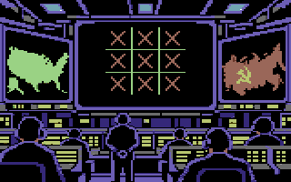 | 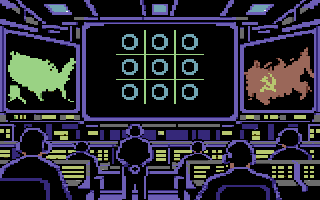 |

The all-X and all-O planes are source references used to extract exact live-cell patches. They are not whole-frame replacements during normal play.

## Raw plane contract

| State type | Files | VIC-II mode / address expectation |
| --- | --- | --- |
| Charset | `crystal-palace-charset.bin` | 2,048 bytes at `$3800` for title/INFO character mode. |
| Title variants | `title-player-{0,1,2}.{screen,color}.bin` | Standard character mode; screen `$0400`, colour RAM `$d800`, charset `$3800`. |
| Archive/info | `info.{screen,color}.bin` | Standard character mode; same screen, colour, and charset locations. |
| Game states | `game-{blank,all-x,all-o}.{bitmap,screen,color}.bin` | Multicolour bitmap mode; 8,000-byte bitmap, 1,000-byte screen plane, 1,000-byte colour plane; `$d021 = 0`. |
| Live patches | `cells/{x,o}-cells.{bitmap,screen,color}.bin` and `cells/bitmap-destination-addresses.bin` | Exact per-cell deltas in real VIC bitmap-address order, not linear raster-byte order. |

Every title/INFO screen or colour plane is 1,000 bytes. Each game bitmap plane is 8,000 bytes; each accompanying screen/colour plane is 1,000 bytes. `crystal-palace-board-coordinates.json` defines the board-cell locations used to derive live patch artifacts.

## Indexed PNG contract

Every preview is PNG colour type **3** (indexed), 8 bits per palette index, with the same fixed 16-entry C64 palette. Combined, mono, and colour-plane images are 320×200. The charset atlas is 128×128. No alpha, RGB conversion, or palette quantization is used.

Palette indices equal native VIC-II colour codes. The renderer uses the Pepto C64 RGB presentation palette:

| Index | VIC-II colour | RGB |
| ---: | --- | --- |
| 0 | Black | `#000000` |
| 1 | White | `#ffffff` |
| 2 | Red | `#68372b` |
| 3 | Cyan | `#70a4b2` |
| 4 | Purple | `#6f3d86` |
| 5 | Green | `#588d43` |
| 6 | Blue | `#352879` |
| 7 | Yellow | `#b8c76f` |
| 8 | Orange | `#6f4f25` |
| 9 | Brown | `#433900` |
| 10 | Light red | `#9a6759` |
| 11 | Dark grey | `#444444` |
| 12 | Medium grey | `#6c6c6c` |
| 13 | Light green | `#9ad284` |
| 14 | Light blue | `#6c5eb5` |
| 15 | Light grey | `#959595` |

## Rebuild and verify previews

The renderer uses Python’s standard library only:

```sh
python3 scripts/render_screen_states.py
python3 scripts/render_screen_states.py --check
```

`--check` regenerates every preview in memory and fails when any checked-in PNG differs. This binds the review images to the raw planes and catches silent palette, layout, or format drift.
